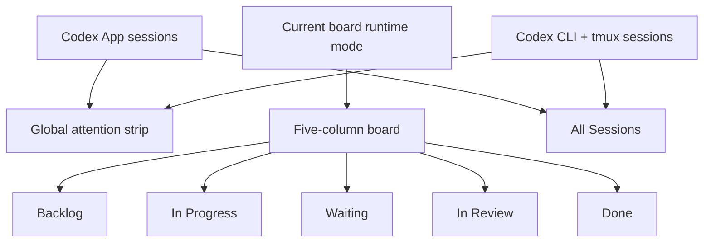
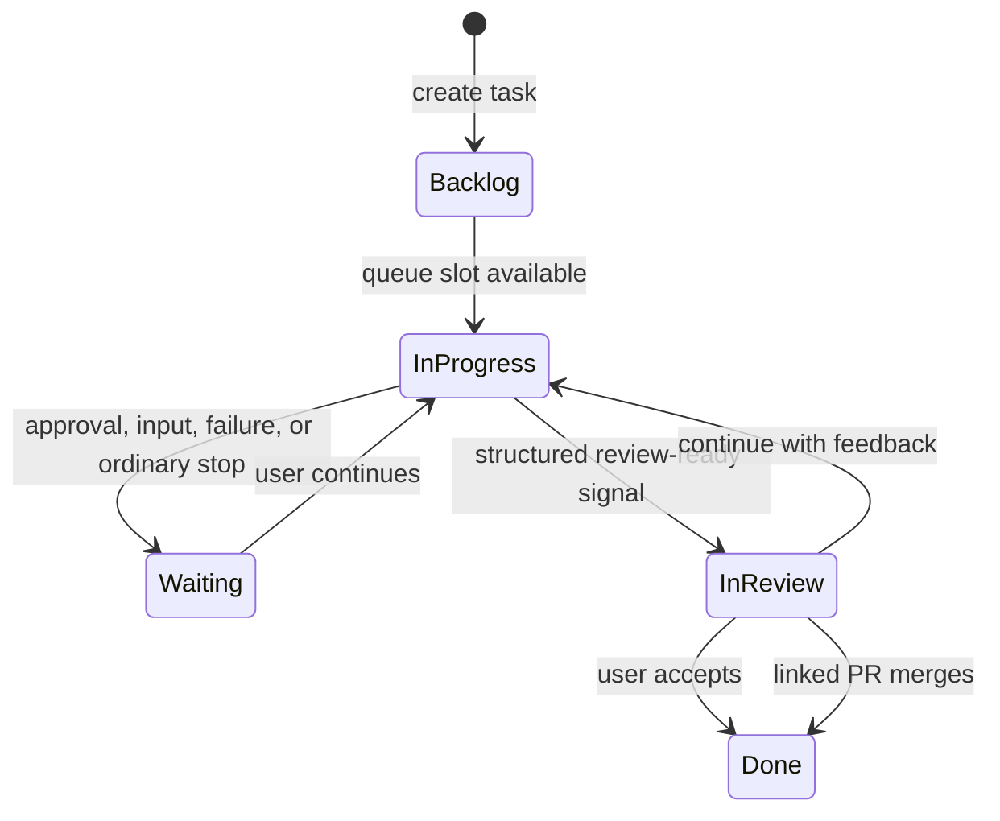
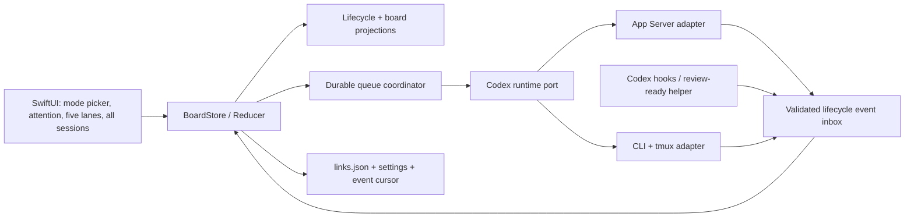
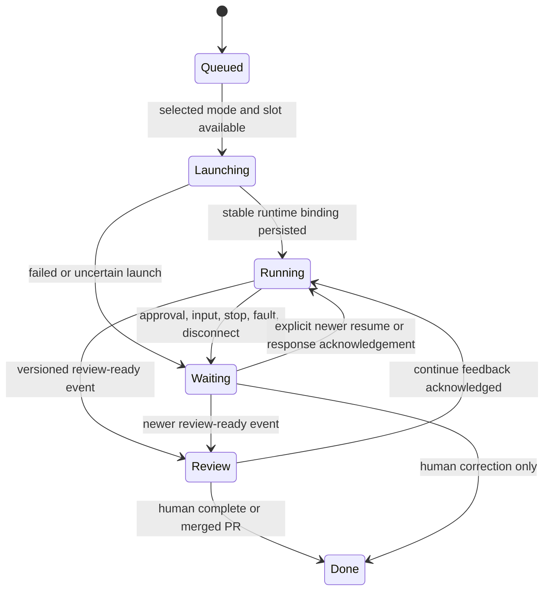
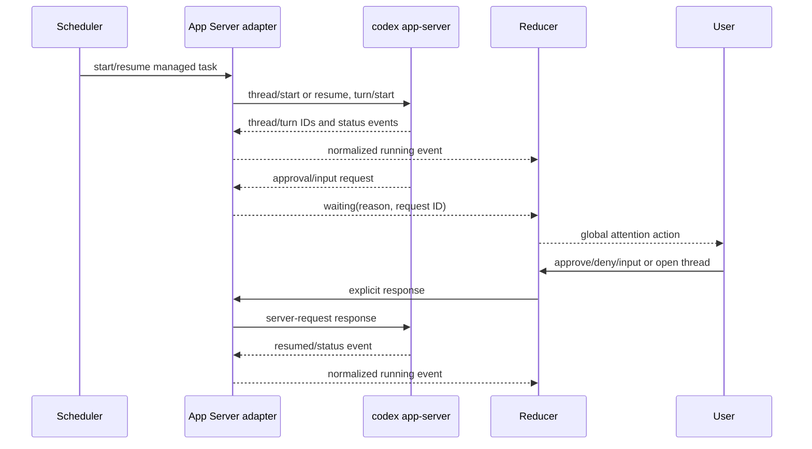

# Codex Session Kanban - Plan

## Goal Capsule

- **Objective:** 构建一个公开开源的 macOS 26 App，以看板级运行模式管理 Codex App 或 Codex CLI + tmux sessions，让用户无需反复切换即可发现正在运行和等待确认的工作。
- **Product authority:** 本文中的产品行为来自已确认的用户选择；Codex 能力边界以官方文档为准，tmux 工作流以参考项目现有实现为依据。
- **Execution profile:** Deep、high-risk integration；以现有 `AppState`/`Reducer`/`Effect` 架构为唯一写入路径，兼容迁移现有 `links.json`，用可注入 fake 隔离真实 Codex/tmux 依赖。
- **Tail ownership:** 本次 LFG 流程负责计划实现、简化、独立代码审查、测试、提交、创建 PR 与跟进 CI；除外部凭据、上游权限或产品范围冲突外不回退给用户。
- **Stop conditions:** 仅在官方协议与已确认产品行为实质冲突、数据迁移不可安全回滚、需要用户凭据/签名身份，或上游仓库拒绝推送且无可用 fork 权限时停止。
- **Open blockers:** 无产品范围阻塞项；规划默认值与兼容策略已在 Planning Contract 中解析。

## Implementation Outcome

- **Delivered:** 看板级 App / CLI + tmux 模式、五列 runtime 投影、跨模式注意力条、最近 App thread 导入、自动领取与并发限制、稳定 binding、审批/输入响应、结构化 review-ready、人工完成/继续修改、非 GitHub 手动待评审、PR 全部合并后完成，以及 App thread / tmux 原 session 打开动作。
- **Durability and compatibility:** lifecycle、launch lease 与 watermark 独立保存在 Swift-owned runtime store；CLI 只读投影该状态；Swift、TypeScript 与 Rust 的共享 settings/link schema 保持向后兼容，Windows writer 保留未知字段。
- **App Server realization:** 实现复用 Codex 自带的 `app-server daemon start` + `app-server proxy`，由 Codex daemon 在 UI 生命周期之外持有 runtime；没有重复实现规划草案中的自定义 SMAppService/socket/token companion。客户端仍提供请求关联、allowlist、大小限制、重连和 thread rehydration。
- **Hook realization:** bundle 内的 lifecycle helper 带 SHA-256 manifest，安装时验证并使用每次 launch 的 capability 绑定 card/session/generation；拒绝安装时保持只读导入和 limited telemetry。
- **Verification:** `swift build`、879 个 Swift tests、CLI build + 279 tests、Web build + 72 tests、完整 `.app` archive、helper manifest、deep codesign 与 zip integrity 已在本机通过。Rust 工具链本机不可用，`cargo fmt --check` 与 `cargo test --lib` 由新增 Windows CI job 执行。
- **Credential-gated follow-up:** Developer ID 签名、公证、托管更新和远程通知继续按 Scope Boundaries 延后；本 PR 产出 ad-hoc signed、可复现的本地 archive。

---

## Product Contract

> Product Contract 的需求与已确认决策保持不变；Planning Contract 只解析实现方式、迁移、验证和风险。依赖假设会在官方实现证据要求时收紧，但不改变产品行为。

### Summary

提供一个可在 Codex App 与 Codex CLI + tmux 两种运行模式间切换的五列任务看板。
当前模式决定五列中显示和调度的任务类型，顶部提醒条跨模式集中显示所有等待人工处理的 sessions。

### Problem Frame

当多个 Codex App 与 Codex CLI sessions 并行运行时，用户必须反复切换任务或终端查看状态，也容易忘记哪个 session 正在等待确认。
现有会话列表展示的是对话历史，不是以人工注意力为中心的工作队列；用户因此承担了持续轮询、记忆分支关系和手动整理状态的成本。

### Key Decisions

- **Codex App 模式采用混合 session 管理。** 看板创建的任务由 App Server 精确管理，现有 Codex App sessions 通过导入与 Hooks 接入。`(session-settled: user-directed — chosen over independent-only or companion-only operation: existing Codex App sessions must remain visible while board-created tasks need precise lifecycle control)`
- **运行类型属于整个看板。** 用户在 Codex App 与 Codex CLI + tmux 之间选择当前模式，而不是为每张卡片单独选择。`(session-settled: user-directed — chosen over per-task runtime selection or automatic fallback: one runtime per board keeps launch, resume, and navigation behavior coherent)`
- **切换模式只改变当前工作视图和后续调度。** 另一类型的 sessions 保留在“全部 Sessions”，切换不得迁移、重启或终止它们。`(session-settled: user-directed — chosen over requiring an empty board or migrating existing sessions: switching must preserve in-flight work without mixing runtimes in the five columns)`
- **顶部注意力提醒跨两种模式。** 即使某个 session 不属于当前看板模式，它等待人工处理时仍必须出现在提醒条中。`(session-settled: user-approved — chosen over filtering alerts to the current runtime: hiding inactive-mode attention requests would recreate the core missed-confirmation problem)`
- **作为公开开源 App 发布。** 产品允许延续参考项目的 AGPL 路线，并把安装、升级和兼容诊断视为正式体验。`(session-settled: user-directed — chosen over a personal-only tool or closed-source product: the app should be publicly distributable and open source)`
- **使用经典五列看板并增加顶部等待提醒。** 完整生命周期保持可见，等待人工处理的 sessions 同时聚合到页面顶部。`(session-settled: user-directed — chosen over an inbox-first dashboard or focused split view: users need both the full workflow and an unmistakable attention queue)`
- **自动领取受并发上限控制。** 当前运行模式的新建任务先排队，出现空闲执行槽位时自动启动。`(session-settled: user-directed — chosen over unlimited immediate launch or manual-only start: automation must remain predictable under parallel load)`
- **仅将最近活跃 sessions 转成工作卡。** 更早的记录保留在“全部 Sessions”中供搜索。`(session-settled: user-directed — chosen over turning every historical session into a board card or requiring manual import: history must not overwhelm the working board)`
- **待评审表示交付物等待人工验收。** 该状态不依赖 GitHub，也不由一次普通 push 决定。`(session-settled: user-directed — chosen over PR-only or push-based review entry: some useful Codex tasks are not associated with GitHub)`
- **Codex 使用结构化信号声明可评审。** 普通 turn 停止或自然语言完成表述不能单独触发待评审。`(session-settled: user-directed — chosen over natural-language classification or treating every stopped turn as review-ready: review transitions must be reliable)`
- **人工验收提供完成与继续修改。** 继续修改将反馈发送到原 session，并恢复进行中状态。`(session-settled: user-directed — chosen over PR-merge-only completion or manual card dragging: non-GitHub work needs a complete review loop)`
- **首版仅支持 macOS 26。** 复用参考项目的平台能力，优先交付核心工作流。`(session-settled: user-directed — chosen over macOS 15 or macOS 14 compatibility: the first release should minimize compatibility work)`
- **首要指标是等待项可见性。** 约 10 个并行 sessions 时，用户应在几秒内发现全部等待确认项。`(session-settled: user-directed — chosen over maximum throughput or onboarding speed as the primary metric: missed attention requests are the core pain)`
- **通过用户授权安装全局 Codex Hooks 或轻量插件。** 看板外创建的现有与未来 sessions 也应获得结构化生命周期信号。`(session-settled: user-directed — chosen over observation-only import or file and language inference: external sessions need trustworthy status transitions)`

### Actors

- A1. **Codex 用户：** 同时管理多个本地 Codex sessions，查看注意力队列并执行人工验收。
- A2. **看板 App：** 管理当前运行模式、创建任务、调度并发、聚合生命周期事件、计算卡片状态并提供导航。
- A3. **Codex runtime：** Codex App session 或运行在 tmux 中的 Codex CLI session，负责执行工作、请求输入或权限，并在交付物准备好时发出结构化信号。
- A4. **可选 Git 提供方：** 为代码任务补充分支、PR、CI 和合并状态，但不决定任务是否能够进入待评审。

### Requirements

**Runtime mode and session intake**

- R1. App 必须提供 Codex App 与 Codex CLI + tmux 两种看板级运行模式，并持续显示当前模式。
- R2. 五列看板必须只显示当前运行模式的工作卡，另一类型的 sessions 必须保留在可搜索的“全部 Sessions”中。
- R3. 切换运行模式不得迁移、重启或终止任何已有 session，并且只影响后续任务调度和五列展示。
- R4. App 必须根据可验证的运行证据识别导入 session 的类型；证据不足时必须标记类型待确认并允许用户纠正。
- R5. 首次接入时，App 必须将当前模式下最近活跃且未归档的 sessions 转换为工作卡，并将更早的 sessions 保留在“全部 Sessions”中。

**Task creation and queue**

- R6. 用户必须能够在待办列新建任务，并提供启动 Codex 所需的任务描述和本地工作区；任务自动继承当前看板模式。
- R7. 当前模式的新建任务必须进入自动队列，并仅在并发上限存在空闲槽位时启动。
- R8. 看板启动的 Codex App 任务必须绑定稳定 thread 标识；Codex CLI 任务必须绑定稳定 Codex session 与 tmux session，使后续状态、反馈和打开动作始终回到原任务。

**Lifecycle and attention**

- R9. 两种运行模式的工作卡必须共用待办、进行中、等待、待评审和完成五个自动状态。
- R10. Codex App 模式必须使用 App Server 生命周期；Codex CLI 模式必须结合 tmux 生命周期与 Codex 结构化事件；外部 sessions 必须优先使用经用户授权的全局 Hooks 或轻量插件事件。
- R11. 所有等待人工输入、权限确认或故障处理的 sessions 必须出现在顶部注意力提醒条，即使它们不属于当前运行模式；属于当前模式的卡片还必须进入等待列。
- R12. 普通 turn 停止但未发出可评审信号时，卡片必须进入等待，而不是被误判为完成或待评审。
- R13. Codex 发出的结构化可评审信号必须使卡片进入待评审，无论运行模式或任务是否关联 GitHub。
- R14. 事件覆盖不完整的外部 session 必须显示“状态受限”，App 不得将推测状态伪装为精确状态。
- R15. App 必须保留手动纠正卡片状态的逃生口，并在下一次明确生命周期事件后恢复自动流转。

**Review and completion**

- R16. 待评审卡片必须提供“完成”和“继续修改”两种人工验收操作。
- R17. “继续修改”必须通过对应运行模式将用户反馈发送到原 Codex session，并使卡片回到进行中。
- R18. 如果代码任务存在 PR，卡片必须展示其评审证据；PR 合并可以自动使卡片进入完成，但 PR 不是进入待评审的前提。

**Navigation and onboarding**

- R19. 卡片和注意力提醒必须提供模式匹配的打开动作：Codex App session 跳转到对应 Codex thread，Codex CLI session 打开或连接对应 tmux 终端。
- R20. 首次启动和模式切换必须检查所选模式的运行条件，并在安装全局 Hooks 或轻量插件前取得用户明确授权。
- R21. 用户拒绝安装 Hooks 时，App 必须继续提供只读 session 导入，并明确说明两种模式下自动状态能力的降级范围。
- R22. App 必须以可公开分发的开源 macOS 26 应用交付，并针对 Codex App、Codex CLI 和 tmux 的依赖缺失或版本不兼容提供可操作诊断。

主界面保持完整流程，同时将等待项提升为独立注意力入口：

### Key Flows

- F1. **First launch and import**
  - **Trigger:** A1 首次启动 App。
  - **Actors:** A1、A2、A3。
  - **Steps:** App 检查两种模式的环境；用户选择看板运行模式和是否授权 Hooks；App 导入当前模式的最近活跃 sessions；其他 sessions 进入“全部 Sessions”。
  - **Outcome:** 五列只包含当前模式的工作，其他 sessions 保持可查，其状态能力清晰可见。
  - **Covered by:** R1、R2、R4、R5、R10、R20、R21、R22。
- F2. **Create and auto-claim a task**
  - **Trigger:** A1 在待办中新建任务。
  - **Actors:** A1、A2、A3。
  - **Steps:** 卡片继承当前运行模式并进入队列；空闲槽位出现；App 通过对应后端创建 Codex session；卡片进入进行中。
  - **Outcome:** 任务无需再次点击即可开始，同时不突破并发上限。
  - **Covered by:** R6、R7、R8、R9。
- F3. **Handle an attention request**
  - **Trigger:** 任一运行模式中的 Codex 请求权限、用户输入或在未交付时停止。
  - **Actors:** A1、A2、A3。
  - **Steps:** session 出现在全局提醒条；若属于当前模式，卡片同时进入等待列；A1 打开对应 Codex App thread 或 tmux 终端；继续后卡片返回进行中。
  - **Outcome:** 等待项不会因其他 session 活动或看板模式切换而被遗漏。
  - **Covered by:** R9、R11、R12、R19。
- F4. **Review and revise**
  - **Trigger:** Codex 发出结构化可评审信号。
  - **Actors:** A1、A2、A3、A4。
  - **Steps:** 卡片进入待评审；App 展示现有交付物和可选 PR 证据；A1 选择完成或继续修改。
  - **Outcome:** 完成使卡片关闭；继续修改将反馈送回原 session 并恢复执行。
  - **Covered by:** R13、R16、R17、R18。
- F5. **Recover from limited telemetry**
  - **Trigger:** 外部 session 已存在，但尚未触发授权后的生命周期事件。
  - **Actors:** A1、A2、A3。
  - **Steps:** App 导入 session 并标记状态或类型受限；用户可纠正类型；下一次提交、恢复或 Hook 事件后，App 切换为精确自动状态。
  - **Outcome:** App 保留可见性，同时避免错误承诺状态准确性。
  - **Covered by:** R4、R5、R10、R14、R15、R21。
- F6. **Switch board runtime mode**
  - **Trigger:** A1 将看板从 Codex App 切换到 Codex CLI + tmux，或反向切换。
  - **Actors:** A1、A2、A3。
  - **Steps:** App 检查目标模式依赖；五列切换到目标类型；原模式 sessions 保留在“全部 Sessions”；所有等待项继续出现在全局提醒条。
  - **Outcome:** 用户可以改变工作方式而不迁移或中断已有 session，也不会失去等待项可见性。
  - **Covered by:** R1、R2、R3、R11、R20。

两种运行模式共用事件驱动的生命周期，GitHub 仅提供可选证据：

### Acceptance Examples

- AE1. **Covers R6, R7, R9.** Given 看板处于 Codex CLI + tmux 模式且并发上限已占满，when 用户连续新建多个任务，then 新卡继承 CLI 模式并保持在待办队列，槽位释放后按顺序自动启动。
- AE2. **Covers R11, R12, R19.** Given 看板处于 Codex App 模式，而一个 CLI session 请求权限，when 事件到达，then 该 session 在几秒内出现在全局提醒条，但不混入当前五列，且用户可一次操作打开对应 tmux 终端。
- AE3. **Covers R13, R16.** Given 一个没有 GitHub 仓库的任务，when 任一运行模式中的 Codex 发出结构化可评审信号，then 卡片进入待评审并提供完成与继续修改操作。
- AE4. **Covers R14, R21.** Given 用户拒绝安装 Hooks，when App 导入外部 session，then session 显示状态受限，不声称能准确识别等待确认。
- AE5. **Covers R17.** Given 用户在待评审卡片选择继续修改并输入反馈，when 反馈成功发送，then 反馈通过原运行模式送回原 session，且卡片进入进行中。
- AE6. **Covers R18.** Given 卡片关联的 PR 已合并，when Git 状态刷新，then 卡片自动进入完成；没有 PR 的卡片仍可通过人工验收完成。
- AE7. **Covers R2, R3, R11.** Given 两种模式都有 sessions 且部分正在运行，when 用户切换看板模式，then 五列只展示目标模式，原模式 sessions 继续运行并保留在“全部 Sessions”，其等待项仍可进入全局提醒条。
- AE8. **Covers R4.** Given 一个导入 session 缺少足以区分 App 与 CLI 的证据，when 导入完成，then App 标记类型待确认并允许用户纠正，而不是静默猜测。
- AE9. **Covers R15.** Given 自动状态被错误事件影响，when 用户手动纠正卡片状态，then 修正立即生效，并仅在下一次明确生命周期事件到达后恢复自动权威。

### Success Criteria

- 约 10 个 Codex App 与 CLI sessions 并行时，所有等待人工处理的 sessions 在事件发生后几秒内出现在顶部提醒条，不受当前看板模式影响。
- 五列看板中不会混入另一运行模式的卡片，切换模式不会中断已有工作。
- 正常的待办、执行、等待、评审、修改和完成路径不要求用户手动拖动卡片。
- 用户从任何等待提醒进入对应 Codex App thread 或 tmux 终端只需一次操作。
- 普通 turn 停止不会被误判为可评审，缺少完整事件的 session 不会显示虚假的精确状态。

### Scope Boundaries

**Deferred for later**

- 手机、Apple Watch、Pushover 或其他远程通知。
- macOS 15 及以下兼容。
- 远程执行、跨设备同步和多人协作。
- 面向非 macOS 平台的客户端。

**Outside this product's identity**

- 将看板扩展为完整的 Codex 对话或代码审查客户端；深度交互继续回到对应 Codex App thread 或 tmux 终端。
- 将 GitHub 设为任务生命周期的必需依赖。
- 在同一个五列看板中混合 Codex App 与 Codex CLI 卡片；跨模式可见性由“全部 Sessions”和全局提醒条承担。
- 将正在运行或已有历史的 session 自动迁移到另一运行模式。

### Dependencies / Assumptions

- Codex App 模式要求 Codex 桌面端用于导航，同时要求可访问且兼容、能运行 `app-server` 的 Codex CLI executable；Codex CLI + tmux 模式要求 Codex CLI 与 tmux。选择对应模式时必须通过实际 capability probe，而不能只检查应用是否存在。
- Codex App Server 能为看板创建的任务提供 thread、turn、等待状态和事件流。
- Codex CLI 能在 tmux 中可靠启动、恢复和接收用户输入，tmux session 能在 App 导航期间保持运行。
- Codex Hooks 能为用户授权的 App 与 CLI 外部 sessions 提供 session、turn、权限请求和停止事件。
- Codex 桌面端继续支持使用 thread 标识打开本地 session 的 deep link。
- 外部 session 在 Hook 安装前已运行时，完整遥测可能要等下一次提交、恢复或生命周期事件。
- Git 分支和 PR 元数据是可选增强；不可用时不得阻断核心任务流。

## Planning Contract

### Assumptions

- 现有安装默认使用 **Codex CLI + tmux** 模式以保持当前行为；新安装在 onboarding 中明确选择。看板模式是全局偏好，不跟随项目筛选器切换。
- 默认全局托管并发上限为 **3**，首版允许在设置中修改但不做按项目覆盖。`launching` 与精确确认的 `running` 托管任务跨两种 runtime 共同占槽；断线或遥测未知的 managed task 在 rehydration 证明已停止前继续占槽。外部观察型、明确的审批/输入/Stop/故障等待、待评审与完成任务不占槽。
- 切换模式后，旧模式已经运行的任务继续运行，旧模式仍在待办队列的任务暂停自动领取；切回该模式后恢复 FIFO 调度。这样不会在五列不可见时静默启动新工作。
- “最近活跃”复用现有 `SessionTimeoutSettings.activeThresholdMinutes = 1440`，即默认 24 小时；已归档 thread、手动归档卡片和更早历史只进入“全部 Sessions”。
- runtime 分类证据优先级为：用户确认 > 看板创建绑定 > 活跃 tmux 绑定 > App Server `sourceKinds`/稳定元数据 > 已知 CLI 元数据 > unknown。证据冲突时保持“类型待确认”，不静默翻转用户确认。
- `codex://threads/<thread-id>` 已由官方文档确认可以打开对应本地 thread；它只作为导航能力，不能假设 Codex 桌面端能接管另一个 App Server 连接持有的审批 RPC。
- 托管 App Server thread 的权限审批和用户输入由看板提供最小响应控件，深度对话仍跳回 Codex App。首版不会自动批准权限，也不会根据普通 Stop 或自然语言自动完成。
- 非 GitHub 任务通过版本化本地 lifecycle signal 声明 `review-ready`；若 runtime 无法安装或调用该能力，保留手动“标记待评审”逃生口并显示状态受限。
- 完成卡片不终止 session；终止执行仍是独立动作。单 PR 卡片只有该 PR `merged` 才可自动完成；多 PR 卡片必须所有相关 PR 均已合并。`closed` 但未合并不能自动完成。

### Key Technical Decisions

- **KTD1 — Runtime provenance 与 assistant 分离。** 新增持久化的 Codex execution backend（App、CLI + tmux、unknown）、ownership（managed、observed）、evidence 与 telemetry quality；`CodingAssistant.codex` 继续只描述 assistant，不承担运行来源。旧 `links.json` 缺字段时解码为 unknown，再由可靠证据补齐。该决策落实 R1–R5、R8、AE8，并继承“运行类型属于整个看板”的 session-settled 决策。
- **KTD2 — 持久化 canonical lifecycle，而不是用瞬时 activity 推列。** 每张任务卡保存规范化 lifecycle snapshot、attention reason、最后明确事件 watermark、launch attempt 和手动纠正 watermark。跨来源事件按 launch generation、稳定 turn identity 和同一 turn 内语义优先级形成 partial order，ingestion sequence 仅作最终 tie-breaker；缺少可比较 provenance 的事件不得清除高权威状态，而应标记 telemetry conflicted/limited。列是 lifecycle 的纯投影；PR 仅作为证据，普通 Stop 投影为 Waiting，只有 `review-ready` 投影为 In Review。拒绝继续扩展 `AssignColumn` 的 mtime/PR 启发式，因为它无法去重、恢复或表达精度。落实 R9–R18、AE3、AE4、AE6、AE9。
- **KTD3 — 所有 runtime 经统一 port/action/effect 驱动。** Core 定义发现、启动/恢复、发送反馈、打开原 session、获取快照、订阅事件和能力诊断的 runtime port。App Server 与 CLI + tmux adapter 共享 contract tests；SwiftUI 不直接写持久化或启动进程。落实 F2–F6，并保持 `AppState` + `Reducer` + `EffectHandler` 单一权威。
- **KTD4 — App Server 由独立 companion 持有，UI 使用可重连的 JSON-RPC client。** launchd/SMAppService 管理的用户级 companion 持有 `codex app-server` 子进程、request correlation、server notifications/requests 与重连状态；macOS UI 通过受本地文件权限和随机配对 token 保护的 IPC 连接，退出 UI 不终止运行中的 turn。App Server 元数据优先于文件系统，文件发现仅作内容与旧版本 fallback。审批请求通过显式用户动作响应，deep link 是 best-effort 打开。拒绝把一次性进程调用、UI-owned child 或 JSONL mtime 当作 App Server 状态。
- **KTD5 — Hooks 与 App Server 统一进入版本化事件 inbox。** 新增最小 helper 接收 hook stdin 或显式 `review-ready` 命令，将经过 schema 验证的事件原子写入本地 inbox；BoardStore 按 event ID、session/thread、turn 与 launch generation 去重并持久化 cursor。安装器合并现有配置、验证信任/版本、支持卸载和受限降级，不把事件内容拼接成 shell。
- **KTD6 — 启动采用 Swift-owned durable lease 和确定性恢复。** launch lease、lifecycle snapshot 与 event watermark 存放在独立的 Swift-owned runtime-state store，按 card ID 关联，不与 CLI/Windows 会整体重写的 `links.json` 共写。队列先持久化 backend/attempt/lease，再执行外部副作用并绑定稳定 thread、Codex session 与 tmux ID。重启时先对账；无法证明成功或失败的 attempt 进入 Waiting/launch-uncertain，由用户重试，禁止无条件重复创建或杀死同名 tmux。
- **KTD7 — 看板投影与全局注意力投影分离。** 五列只从当前 board backend 的 cards 派生；attention 从所有 project/backend 中处于 Waiting 且仍有用户输入、权限审批、普通 Stop 或故障处理原因的 sessions 派生，不受模式或项目筛选。In Review 本身不进入提醒条，除非同时存在独立未解决的 waiting reason。`.allSessions` 继续作为存储归档状态，但从第六列移出，复用搜索基础设施提供单独入口。落实 R2、R3、R11、AE2、AE7。
- **KTD8 — Continue 以 runtime acknowledgement 为提交点。** 待评审中发送反馈时保留 In Review 与 busy 状态；App Server 收到 `turn/start` 或 `turn/steer` 成功响应、CLI 完成原 session resume 与 paste 后才进入 In Progress。审批 waiting 只能响应审批或打开原 session，不能把普通反馈盲发到终端。落实 R16、R17、AE5。
- **KTD9 — 向后兼容跨 Swift/TypeScript/Rust 共享文件。** 展示/绑定字段全部 optional/backward-decodable；高一致性的 lease/lifecycle/watermark 只写 Swift-owned runtime-state store。CLI 类型与 fixtures 同步；Windows 首版不增加 UI，但 Rust round-trip 必须通过 flattened unknown-field map 保留未识别的 per-link 属性。迁移前保留旧文件的可读性，任一 writer 失败不得清空设置、卡片或 runtime state。

### High-Level Technical Design

以下设计是边界和数据流草图，具体类型拆分可在实现中按现有命名调整，但不得绕过 reducer/effect 或改变 Product Contract。

App Server 的 server request 不能仅靠导航解决：

### Implementation Units

#### U1 — Migration-safe runtime and lifecycle domain

- **Depends on:** none.
- **Traces:** R1–R5, R8–R15, F1, F5, F6, AE4, AE8, AE9, KTD1, KTD2, KTD9.
- **Files:** `Sources/KanbanCodeCore/Domain/Entities/Link.swift`, `Session.swift`, `ActivityState.swift`, `ManualOverrides.swift`, `CodingAssistant.swift`, new domain files for execution backend/lifecycle event; `Sources/KanbanCodeCore/Infrastructure/SettingsStore.swift`, `CoordinationStore.swift`, new Swift-owned runtime-state store; `cli/src/types.ts` and persistence fixtures; `windows/src-tauri/src/coordination_store.rs` and Rust round-trip tests.
- **Approach:** add optional persisted execution binding, ownership/evidence/telemetry and manual confirmation fields to shared cards, while lifecycle snapshot, attention reason, launch lease and event/manual watermarks live in a separately versioned Swift-owned store. Preserve decoding of every existing fixture and unknown future enum value. Windows preserves unknown per-link JSON properties via a flattened map. Default existing installs to CLI board preference while existing Codex cards remain unknown until evidence resolves them.
- **Test scenarios:** old link/settings fixtures decode without data loss; new fields round-trip; unknown enum values degrade to unknown/limited; a CLI or Windows card move/rename cannot erase runtime-state or unknown macOS fields; user-confirmed runtime outranks conflicting discovery; stale lifecycle event cannot clear a newer manual correction; a newer authoritative event can.
- **Observable result:** existing users open the upgraded app with cards intact, and every Codex card can represent precise, limited or ambiguous runtime/lifecycle without overclaiming.

#### U2 — Canonical lifecycle reducer and board projections

- **Depends on:** U1.
- **Traces:** R2, R3, R9–R18, F3–F6, AE2, AE3, AE6, AE7, AE9, KTD2, KTD7.
- **Files:** new lifecycle reducer/projector under `Sources/KanbanCodeCore/UseCases/`; `Sources/KanbanCodeCore/UseCases/AssignColumn.swift`, `CardReconciler.swift`, `BoardStore.swift`; `Sources/KanbanCodeCore/Domain/Entities/KanbanCodeCard.swift`; `Tests/KanbanCodeCoreTests/AssignColumnTests.swift`, `CardLifecycleTests.swift`, `ReducerTests.swift`, `CardReconcilerTests.swift`, new projection tests.
- **Approach:** normalize external events into one reducer with idempotency and ordering; derive column, attention and telemetry badges from persisted lifecycle. Fix reconciler to retain `Session.assistant` and runtime evidence. Remove “PR + stopped = In Review”; only merged PR or human acceptance completes. Split mode-filtered lanes from global attention and keep All Sessions outside the five lanes.
- **Test scenarios:** duplicate/out-of-order App Server and Hook events; cross-source events use generation/turn/semantic precedence and incomparable events mark telemetry conflicted without clearing higher authority; ordinary Stop remains Waiting; review-ready then duplicated Stop remains In Review; closed-unmerged PR is not Done; a single merged PR is Done; one merged plus one open or closed-unmerged PR remains incomplete; inactive-mode Waiting with an unresolved attention reason appears in attention/All Sessions while queued, running and plain In Review do not; mode switch never mutates or terminates bindings; archived/deleted imports do not resurrect.
- **Observable result:** automatic movement is deterministic, restart-safe and faithful to the five product states.

#### U3 — App Server client, discovery authority and managed approvals

- **Depends on:** U1, U2.
- **Traces:** R4, R5, R8, R10–R14, R17, R19–R22, F1–F5, AE2–AE5, KTD3, KTD4, KTD8.
- **Files:** new `CodexAppServerClient`, companion executable, IPC transport and adapter under `Sources/KanbanCodeCore/Adapters/Codex/` and `Sources/`; new runtime ports under `Sources/KanbanCodeCore/Domain/Ports/`; `CodexSessionDiscovery.swift`, `CompositeSessionDiscovery.swift`, `DependencyChecker.swift`; `Package.swift`, `Makefile`; App Server/IPC fakes and tests under `Tests/KanbanCodeCoreTests/Codex/`.
- **Approach:** a launchd/SMAppService-managed companion owns `codex app-server`; unsigned development builds can use an explicitly launched companion with the same IPC contract, never a UI-owned child. The Unix socket and 256-bit random pairing token live under a user-owned runtime directory with directory mode `0700` and token mode `0600`; the companion verifies same UID plus constant-time token equality and refuses insecure permissions. Resolve and retain an absolute Codex executable path outside the active project, launch without a shell from a fixed trusted working directory and a documented environment allowlist, and show the resolved path/version/signature status in diagnostics. Re-probe identity and `app-server` capability before use; reject project-local shadowing and require explicit user confirmation for a changed or nonstandard unsigned path rather than silently switching binaries. Reuse Codex-managed authentication without copying tokens into settings, links, inbox or fixtures; redact auth fields and secret environment keys, rotate local logs at 10 MB/7 days, and treat auth failure as capability degradation. Implement initialize/list/resume/start/turn start/steer, streamed status, allowlisted server request methods, reconnect and list-based rehydration; correlate responses to outbound request IDs and clear pending maps on process generation change. Approval UI uses trusted native app chrome, displays exact request type, command/resource, workspace, thread and sandbox scope available from the protocol, binds to the pending request ID plus launch generation, revalidates immediately before sending and defaults to deny on mismatch. Merge App Server and filesystem discovery by stable thread ID with explicit authority; preserve limited fallback when protocol/version is unavailable.
- **Test scenarios:** interleaved responses/notifications; unknown server-request method and unmatched response rejection; request timeout and process exit; UI quit/relaunch preserves an active companion turn and pending request; companion restart rehydrates threads but rejects previous-generation requests; SMAppService registration and explicit development companion fallback; IPC refuses wrong token, wrong UID and insecure token permissions; source-kind classification and ambiguous conflict; stale/mismatched approval defaults to deny and assistant content cannot render approval chrome; executable resolution rejects project-local shadowing and re-probes changed paths; authentication material never reaches persisted records or rotating logs; deep-link navigation is independent from RPC response; feedback acknowledgement targets the same thread; missing desktop app, missing executable or failed protocol initialization yields actionable degraded capability.
- **Observable result:** managed Codex App tasks have stable thread IDs and precise lifecycle, while imported threads remain visible with honest capability labels.

#### U4 — Codex lifecycle inbox, hook installer and review-ready helper

- **Depends on:** U1, U2.
- **Traces:** R10, R13–R15, R20–R22, F1, F4, F5, AE3, AE4, AE9, KTD5.
- **Files:** new lifecycle helper executable target in `Package.swift` and `Sources/`; `Makefile` and release packaging; new inbox/store under `Sources/KanbanCodeCore/Adapters/Codex/`; `Sources/KanbanCodeCore/Adapters/ClaudeCode/HookManager.swift` or a Codex-specific installer; `CodingAssistant.swift`, `DependencyChecker.swift`; `cli/src/hooks.ts`, `cli/src/codex-runtime.test.ts`; `HookManagerTests.swift` and new lifecycle inbox tests.
- **Approach:** define a versioned local event envelope capped at 1 MB/event and 10,000 queued events with atomic append and rotation. Each managed launch receives a 256-bit `SecRandomCopyBytes` per-attempt capability stored only with its Swift-owned lease; reducer acceptance requires constant-time capability comparison plus task/session/generation binding. This limits unrelated-process forgery but does not claim protection from a process that already controls the same user account. Review-ready remains non-authorizing and can only request human review. Bundle the helper, verify it against the packaged manifest/hash, atomically install the authorized version under `~/.kanban-code/bin`, and point hooks at that stable path; installation rejects downgrade/tampered payloads while preserving restrictive directory, binary and backup permissions. Merge Codex hook config without overwriting user config, capability-probe version/trust, validate bindings, rotate retention, and allow uninstall. Inject task/session context into board-launched App and CLI work so signals bind to the current attempt.
- **Test scenarios:** packaged-app install/upgrade/uninstall preserves unrelated config and invokes the verified stable helper path; downgrade/tampered helper rejection; authorization refusal retains read-only import; malformed, over-1-MB, queue-overflow, stale, replayed, cross-session and missing-capability events are ignored with diagnostics; duplicate event IDs are idempotent; App and CLI transports produce the same normalized review-ready; Stop never produces review-ready; old Codex trust-modal behavior reports limited capability.
- **Observable result:** both runtimes can emit trustworthy review-ready and external sessions degrade visibly instead of being guessed.

#### U5 — Durable auto-claim scheduler and dual-runtime launch effects

- **Depends on:** U1, U2, U3, U4.
- **Traces:** R3, R6–R10, R17, F2, F6, AE1, AE5, AE7, KTD3, KTD6, KTD8.
- **Files:** new queue coordinator under `Sources/KanbanCodeCore/UseCases/`; `BoardStore.swift`, `LaunchSession.swift`, `BackgroundOrchestrator.swift`; runtime adapters; `Sources/KanbanCode/ContentView+Launch.swift`, `NewTaskDialog.swift`; scheduler, launch-flow and reducer tests.
- **Approach:** move auto-start ownership from SwiftUI to a serialized Core coordinator. Validate the global concurrency setting in `1...32`, persist queued/launching lease before effects, claim FIFO within selected mode and global capacity, pause inactive-mode queued work, and release slots only on precise non-running states. A disconnect or telemetry-unknown managed task retains its lease until rehydration proves the turn stopped. Board-created tmux sessions use a reserved `kanban-code-<card-id>-<generation>` namespace and runtime-state ownership tag; reconciliation must verify both before matching. Reuse `LaunchSession`/`TmuxAdapter` for CLI without destructive uncertain retry; App mode starts a thread/turn through U3. Continue resumes the exact binding and commits state only after acknowledgement; after a 30-second acknowledgement timeout it enters resume-uncertain with preserved feedback, retry and open-original actions.
- **Test scenarios:** capacity 3, bounds 1/32 and FIFO; rapid capacity changes trigger one atomic scheduling pass; simultaneous refresh claims each card once; switching mode pauses hidden queue but does not stop running work; running work across modes counts globally; transient disconnect never frees capacity before reconciliation; external observed sessions do not consume slots; tmux namespace collision without matching ownership tag is rejected; launch failure releases slot; crash at lease, thread-created, tmux-created and pre-binding boundaries recovers without duplicate execution; lost Continue acknowledgement becomes resume-uncertain without duplicating feedback.
- **Observable result:** Backlog tasks auto-run predictably in either mode without UI presence, duplication or hidden oversubscription.

#### U6 — Attention-first five-column UI and All Sessions vertical slice

- **Depends on:** U2.
- **Traces:** R1–R5, R11, R14, R19, F1, F3, F5, F6, AE2, AE4, AE7, AE8, KTD7.
- **Files:** `Sources/KanbanCode/ContentView.swift`, `BoardView.swift`, `CardView.swift`, `ColumnView.swift`, `CardDetailView.swift`, `SearchOverlay.swift`, `NewTaskDialog.swift`; new `AttentionStrip.swift` and runtime-mode UI helpers; navigation/accessibility tests under `Tests/KanbanCodeTests/` and Core projection tests.
- **Approach:** deliver the primary attention value before managed App scheduling: add toolbar board-mode picker, show exactly five lanes from the mode projection, expose All Sessions as searchable sheet/list and render existing/observed lifecycle with honest telemetry badges. Define an `AttentionItem` presentation contract with session title, runtime, project, reason, age, telemetry quality, primary action and secondary open action; deduplicate by session/request, prioritize permission/input before faults, stops and disconnects, keep failed/expired actions visible with recovery copy, and use a compact fixed-height keyboard-navigable list with total count. The mode picker shows per-runtime running and paused-queue counts, warns that the departing queue pauses, and links to filtered All Sessions while nonempty. Runtime correction is a labeled detail/All Sessions menu showing evidence; when correction removes a card from the board, show a confirmation with destination and Open in All Sessions. Mode-managed new tasks are Codex-only: replace the per-task assistant picker with a read-only Codex/current-runtime summary; preserve pre-existing Claude/Gemini cards as legacy CLI items in All Sessions.
- **Accessibility contract:** logical focus order runs mode picker → attention items → lanes; runtime/telemetry badges expose VoiceOver labels and values; open, type-correct and attention actions have named accessibility actions and keyboard activation; focus restores after resolution/failure and new attention arrival is announced.
- **Test scenarios:** inactive-mode approval remains in attention but not lanes; project filter does not hide global attention; attention priority/dedup/count/pending-error behavior remains scannable with ten mixed items; queued/running/plain In Review do not enter attention; type correction reprojects and explains the destination; deep-link URL encodes thread ID and failure surfaces fallback; five lanes never append All Sessions; keyboard/VoiceOver semantics and focus restoration are present.
- **Observable result:** at roughly 10 sessions the user can identify every waiting item within seconds and open the correct runtime with one action.

#### U7 — Onboarding, settings, diagnostics and compatibility UX

- **Depends on:** U3, U4, U5, U6.
- **Traces:** R1, R5, R7, R20–R22, F1, F6, AE1, AE4, KTD9.
- **Files:** `Sources/KanbanCode/OnboardingWizard.swift`, `SettingsView.swift`; `Sources/KanbanCodeCore/Infrastructure/SettingsStore.swift`, `DependencyChecker.swift`; `Makefile`; settings/dependency/onboarding and bundle-metadata tests; README documentation.
- **Approach:** separate status rows for Codex desktop navigation, compatible Codex executable/App Server protocol, companion registration/dev fallback, Codex CLI execution, tmux and lifecycle Hooks; request authorization before config mutation; show partial-install and trust-probe failures; expose board mode, bounded max concurrency and recent-window setting; preserve use of the available runtime when another is unavailable. Define Hook-refusal degradation explicitly: App imports may use App Server discovery/status when available, CLI imports use tmux plus session-file evidence, all affected cards show unknown/limited telemetry, and filesystem mtime alone cannot infer Waiting, In Review or Done. Set packaged `LSMinimumSystemVersion` to `26.0`. Document capability matrix, resolved executable path, privacy/local files and recovery/uninstall.
- **Test scenarios:** fresh install selects either mode; App mode requires both desktop navigation and successful `app-server` protocol initialization; existing install defaults CLI without losing settings; target mode unavailable rejects switch with actionable diagnostic; Hook refusal/partial failure preserves the specified read-only discovery paths and never infers lifecycle from mtime; settings unknown fields survive; concurrency change triggers exactly one scheduling pass; built bundle declares macOS 26 minimum.
- **Observable result:** users can understand what automation is precise, degraded or unavailable before trusting the board.

#### U9 — Managed runtime actions and review/approval integration

- **Depends on:** U3, U4, U5, U6.
- **Traces:** R6–R10, R12–R19, F2–F4, AE1, AE3, AE5, AE6, KTD3, KTD4, KTD8.
- **Files:** `Sources/KanbanCode/AttentionStrip.swift`, `CardDetailView.swift`, `ContentView+Launch.swift`, `NewTaskDialog.swift`; `BoardStore.swift`; runtime action state helpers and UI/Core integration tests.
- **Approach:** layer managed launch, request-bound approval/input, Complete and Continue onto U6's observed-session UI. Use one recoverable action-state model: preserve input drafts until acknowledgement, disable only the submitted action while pending, show inline progress and request-scoped errors, retry idempotently, and restore focus to the unresolved item on failure. Approval actions display exact trusted request context and revalidate request/generation before response; review feedback targets the original session and moves only after backend acknowledgement.
- **Test scenarios:** App approval/input and CLI open/resume use reason-specific actions; stale request denial and duplicate action suppression; Continue failure preserves draft and In Review; acknowledged Continue moves to In Progress; Complete does not terminate session; keyboard and VoiceOver actions expose the same behavior as pointer controls.
- **Observable result:** the early attention slice becomes the complete managed App/CLI workflow without changing its presentation or lifecycle source of truth.

#### U8 — End-to-end verification, docs and release evidence

- **Depends on:** U1–U7, U9.
- **Traces:** all requirements, flows and acceptance examples.
- **Files:** integration suites in `Tests/KanbanCodeCoreTests/` and `Tests/KanbanCodeTests/`; CLI and Windows round-trip tests; `Makefile` packaging assertions; `README.md`, `docs/` capability/recovery notes; PR body and screenshots where practical.
- **Approach:** run fake-backed deterministic CI plus opt-in local real-runtime smoke tests. Exercise first launch, import, queue, attention, approval, review/continue, PR merge, mode switching and restart. Produce a reproducible macOS `.app` and downloadable archive in CI, verify launch from the packaged artifact, and document first install plus manual upgrade. Record known App Server/Hook version boundaries; Developer ID signing, notarization and automatic hosted updates remain credential-gated rather than blocking the unsigned distributable artifact.
- **Test scenarios:** full App-mode and CLI-mode happy paths; mixed-mode attention; Hook denied; App Server disconnect/reconnect; app restart during launch; ordinary Stop; non-GitHub review; merged and closed-unmerged PR; deep-link and tmux open actions; packaged `.app` contains companion/helpers, declares macOS 26 and launches in a clean test location.
- **Observable result:** the PR contains a reproducible installable artifact and evidence for the core lifecycle, with hardware/local-environment-only smoke and credential-gated signing status clearly labeled.

### System-Wide Impact

- **Persistence and migration:** `links.json` gains optional display/binding fields consumed by Swift and typed by CLI, while launch/lifecycle/watermark state is isolated in a Swift-owned store that other writers cannot clobber. Migration is lazy and backward-compatible. Settings decoding must remain field-isolated so a future enum value cannot wipe projects. Lifecycle inbox and cursor require bounded storage, atomic writes and local-user-only permissions.
- **State authority:** `BoardStore.swift` remains the active macOS authority; legacy `BoardState.swift` is not extended except where an existing compatibility test requires it. UI changes dispatch actions only. Reconciliation discovers resources but does not independently assign product lifecycle.
- **Process lifecycle:** a user-level companion owns the restartable App Server child; the UI app owns only an authenticated same-UID local client and existing tmux presentation. IPC socket/token live in a `0700` runtime directory and the token is `0600`. UI termination must not kill user work. Reconnect reconciles stable IDs before scheduling. Child stdout/stderr must be drained to avoid deadlock; rotating 10 MB/7-day logs redact prompt, event, authentication and secret environment payloads.
- **Security and approvals:** Hook payloads and App Server notifications are untrusted local input. Validate size/schema/source binding and per-attempt capability; never execute event text. The capability limits accidental/cross-session forgery but is not a boundary against full same-user compromise. Permission requests are human-only, display protocol-derived scope in trusted app chrome, bind to a current request/generation, revalidate before response and require an explicit click; mismatch or uncertainty denies, with no automatic allow fallback. Codex authentication remains Codex-managed and is never persisted or logged by the board.
- **Performance:** roughly 10 sessions is the primary target, but event processing should be O(events + cards) per batch, projections cached by `AppState.rebuildCards`, App Server list paginated, and UI updates coalesced to avoid rendering every raw notification.
- **GitHub behavior:** PR discovery remains optional. Replace current “any closed/merged means all done” behavior for automatic completion with “all relevant PRs merged” or explicit human completion. Multiple PR evidence remains display-only until the lifecycle reducer decides Done.
- **Cross-platform:** Windows and web/CLI readers must tolerate optional fields; Windows writers must round-trip unknown per-link fields and cannot write the Swift-owned runtime-state store. macOS UI is the only v1 feature surface; no Windows runtime-mode UI is required.
- **Operations:** diagnostics must distinguish dependency missing, protocol incompatible, hook unauthorized, hook trust blocked, disconnected and limited telemetry. These are product states, not generic errors.

### Risks and Mitigations

- **App Server approval ownership:** deep linking may not transfer a request held by this App Server process. Mitigation: implement minimal explicit server-request responses in the board and treat deep link only as navigation; cover with fake protocol tests and an opt-in real-runtime spike before declaring precise support.
- **Protocol drift:** App Server and Hooks can evolve. Mitigation: capability negotiation, tolerant decoders, versioned event schema, fixture-based contract tests and visible limited mode instead of silent fallback.
- **Duplicate launches after crash:** external side effects can succeed before persistence. Mitigation: durable attempt IDs, deterministic tmux names, thread/session reconciliation and uncertain-launch waiting rather than automatic destructive retry.
- **False lifecycle precision:** imported sessions may lack source or Hook history. Mitigation: explicit telemetry quality, evidence precedence, unknown classification and user correction that survives stale events.
- **Hook trust/config damage:** Codex versions may show interactive trust prompts and users may already have hooks. Mitigation: merge/backup/rollback config, probe actual behavior, require authorization and support uninstall.
- **Hidden work after mode switch:** inactive-mode running work remains active while lanes hide it. Mitigation: global attention, All Sessions visibility, global concurrency accounting and pause of inactive-mode queued cards.
- **Scope/PR size:** the feature crosses domain, adapters, scheduler and UI. Mitigation: keep each unit buildable and testable, commit by unit, prefer adapter fakes, and stop adding adjacent Windows/remote-notification work.

### Verification Contract

**Automated gates**

- `swift build` succeeds for all SwiftPM products, including companion/helper targets; the packaged app bundles/signs required executables and declares `LSMinimumSystemVersion = 26.0`.
- `swift test` passes existing and new Core/UI logic tests with no dependence on a running Codex App, live tmux or user home session data.
- From `cli/`, the repository's pinned package-manager install/check/test commands pass after shared types/hook changes.
- `git diff --check` reports no whitespace errors; no generated build artifacts or user-local lifecycle data are committed.

**Contract suites**

- Both runtime adapters pass one shared behavior suite for discover, start, bind, wait, continue, review-ready, open and recover, with backend-specific capability assertions.
- Lifecycle table tests cover duplicate, out-of-order, stale-generation and conflicting-source events, plus manual watermark behavior and telemetry degradation.
- Scheduler tests use a deterministic clock and fake runtimes to prove capacity, FIFO, mode switching, slot release and crash recovery.
- Persistence fixtures prove old Swift/CLI records decode and round-trip without loss; future/unknown enum values degrade safely.

**Integration and smoke gates**

- Fake App Server integration validates JSON-RPC multiplexing, server requests, disconnect/reconnect and rehydration.
- Fake tmux/runtime integration validates same-session resume, non-destructive uncertain recovery and feedback acknowledgement.
- SwiftUI-facing tests validate five-lane filtering, global attention, All Sessions entry and mode-aware navigation helpers.
- When a compatible local Codex/tmux environment exists, run an opt-in smoke matrix and record results in the PR; absence of that environment is documented, not hidden as a passed test.

### Definition of Done

- All Product Contract requirements map to at least one implemented and verified unit; every acceptance example has an automated or explicitly documented smoke assertion.
- Existing cards/settings migrate without loss, and ambiguous/limited state is visible rather than guessed.
- A new task in either selected mode is durably queued, auto-claimed within capacity, bound to its original session and recoverable after app restart.
- Waiting items from both modes appear in the global strip within the next event-processing cycle, independent of board/project filters.
- Ordinary Stop never enters In Review; structured review-ready does so without GitHub; Continue targets the same session and only advances after acknowledgement.
- A single merged PR, or all relevant PRs on a multi-PR card, can complete a card; any open or closed-unmerged relevant PR prevents automatic completion; human Complete works for non-GitHub tasks.
- Five columns show only the selected mode, All Sessions remains searchable, and switching modes does not migrate, restart or terminate existing sessions.
- App threads open via the documented `codex://threads/<thread-id>` form with fallback diagnostics; CLI cards reconnect to their tmux/session.
- CI produces a reproducible installable `.app` archive containing the companion/helpers, and documentation covers first install plus manual upgrade; missing Developer ID credentials only mark signing/notarization as unavailable.
- Automated gates pass, code-review findings at actionable severity are resolved or explicitly documented, branch is pushed and a PR is created with verification evidence.

### Open Questions

**Resolved During Planning**

- 默认并发上限为 3，可全局配置；跨模式托管运行计数，外部观察 session 不计数。
- 最近活跃复用现有 24 小时设置。
- 看板模式为全局偏好；现有安装默认 CLI + tmux。
- 手动纠正由 lifecycle watermark 保护，仅更新的明确事件恢复自动权威。
- review-ready 使用版本化本地事件 schema；不同 backend 可有不同 transport，但共享 reducer 语义。
- inactive-mode 已运行任务继续，待办队列暂停，切回恢复。

**Deferred Beyond This Feature PR**

- Developer ID 签名、公证、Sparkle/自动更新通道与长期安装包托管；本 PR 仍必须产出可复现的未签名 `.app` archive 和手动升级说明。
- 远程通知、跨设备状态、Windows UI 和多人协作。

**Implementation-time capability check**

- 用当前安装的 Codex 版本验证：桌面 deep link 是否只能导航，还是也能观察/处理由独立 App Server 连接持有的请求。无论结果如何，最小 board approval response 仍是安全基线；测试结果只调整 capability 文案，不改变产品范围。

### Sources / Research

- `README.md`：参考项目的卡片、reconciler、GitHub、通知和自动列流转概览。
- `Sources/KanbanCodeCore/Adapters/Codex/CodexSessionDiscovery.swift`：现有 Codex session 文件发现能力。
- `Sources/KanbanCodeCore/Adapters/Codex/CodexActivityDetector.swift`：现有基于文件修改时间的 Codex 状态推断及其局限。
- `Sources/KanbanCodeCore/Domain/Entities/CodingAssistant.swift`：Codex CLI 的启动、恢复和 tmux 交互参数。
- `Sources/KanbanCodeCore/UseCases/LaunchSession.swift`：在 tmux 中启动与恢复 coding assistant session 的现有流程。
- `Sources/KanbanCode/NewTaskDialog.swift`：参考项目当前的新任务 assistant 选择与默认值记忆方式。
- `Sources/KanbanCodeCore/UseCases/AssignColumn.swift`：参考项目当前的自动列分配规则。
- `Sources/KanbanCodeCore/Domain/Entities/Link.swift`：Card 与 session、worktree、PR 等资源的聚合关系。
- [Codex App Server](https://learn.chatgpt.com/docs/app-server)：thread、turn、审批、等待状态和事件流。
- [Codex Hooks](https://learn.chatgpt.com/docs/hooks)：生命周期事件、权限请求、用户提交和停止事件。
- [ChatGPT desktop app commands](https://learn.chatgpt.com/docs/reference/commands#deep-links)：`codex://` session deep links。
- `LICENSE`：参考项目的 AGPLv3 许可边界。
